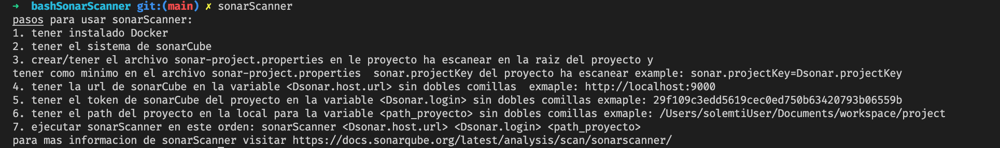

# bashSonarScanner

<p align="center">
  
</p>

[](https://github.com/Elfocrash/vistr.dev)
[](https://github.com/bogarin)

## :open_mouth:  que es bashSonarScanner?

Es un script que se encarga de ejecutar el programa sonar-scanner en una carpeta local determinada, establecida en un contenedor, para ejecutar el sonar-scanner necesitas tener instalado docker.

## :thinking: como funciona bashSonarScanner?

llamando la función en la terminal preferida del programador indicando los valores que te permite sonarqube 🧑🏿‍💻 ejemplo:
cuando configuras un proyecto en javascript o python te dará al final d ela configuración una información similar a esta.

```bash
sonar-scanner \
  -Dsonar.projectKey=pruebas \
  -Dsonar.sources=. \
  -Dsonar.host.url=http://localhost:9000 \
  -Dsonar.login=3910de611047006cb3ca29c5e5ff8bc89f5d3757

```

lo cual de estos datos solamente necesitaras estos campos en este orden.

```bash
 sonarScanner Dsonar.host.url Dsonar.login path_local_proyecto

```

estableciendo los datos del ejemplo:

```bash
sonarScanner http://localhost:9000 3910de611047006cb3ca29c5e5ff8bc89f5d3757 /pathlocal/proyecto

```

## :mechanical_arm: Como instalarlo?

### [ZSH](https://github.com/ohmyzsh/ohmyzsh/wiki/Installing-ZSH)

1. Abrir le archivo zshrc con tu editor de texto preferible en nuestro caso [vscode](https://code.visualstudio.com/).

    ```bash
        code ~/.zshrc
    ```

2. Introduzca el script al archivo zshrc que se encuentra en [sonarScanner.sh](./sonarScanner.sh).
3. grabar y ejecutar el comando source.

    ```bash
        source ~/.zshrc
    ```

Listo!!!!
 

### BASH

1. Abrir le archivo bashrc con tu editor de texto preferible en nuestro caso [vscode](https://code.visualstudio.com/).

    ```bash
        code ~/.bashrc
    ```

2. Introduzca el script al archivo bashrc que se encuentra en [sonarScanner.sh](./sonarScanner.sh).
3. grabar y ejecutar el comando source.

    ```bash
        source ~/.bashrc
    ```

Listo!!!!
 

Por el momento solo funciona en linux y Mac, pero en el futuro se estará implementando en windows de igual forma si gustan colaborar con este script es bienvenido :+1: .
